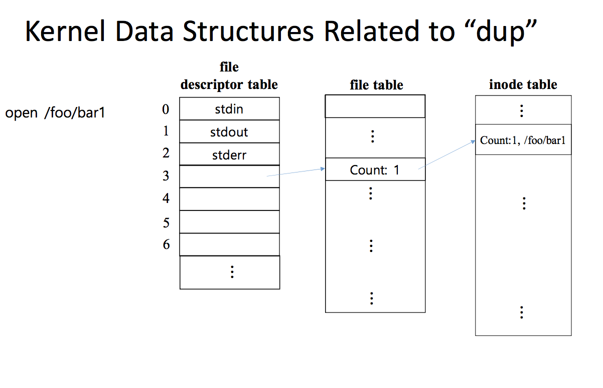
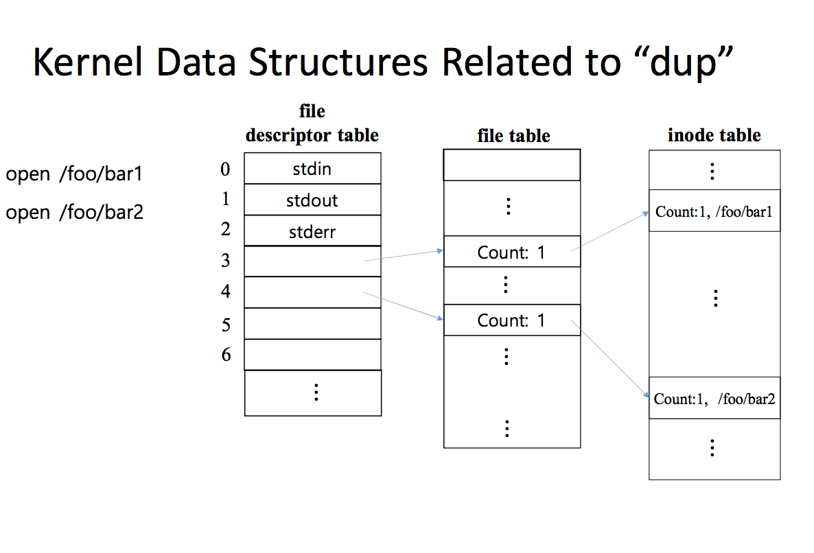
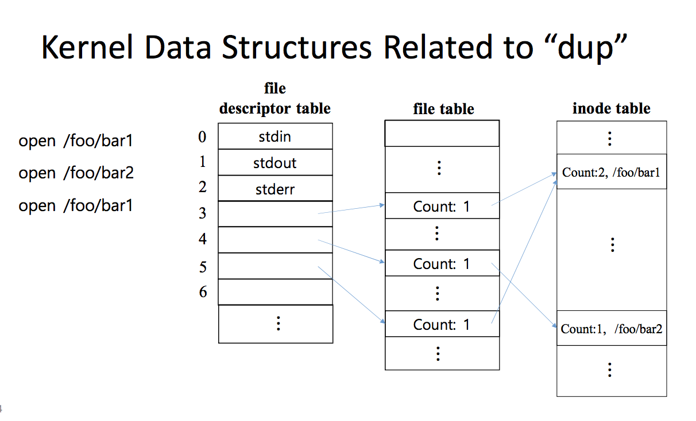
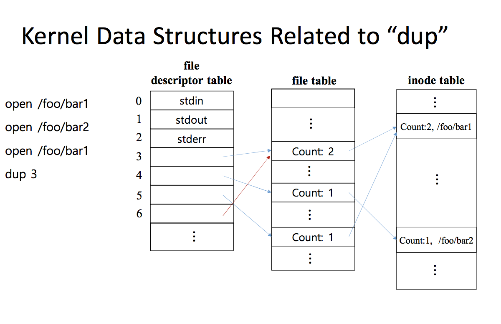
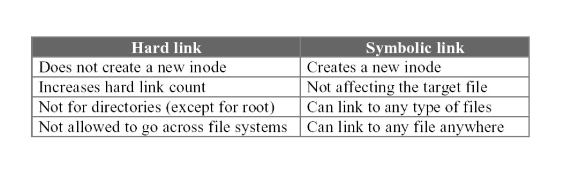

# 시스템프로그래밍

## Basic Shell Commands

### Information

- `man` : gives information about command
- `apropos, whatis` : similar to  `man`
- `which` : shows fulll path of command
- `stat` : File and Inode information
- `uname` : print system information

### User Specific
- `useradd` : create user
- `userdel` : delete user
- `passwd` : change or create user password
- `who` : to find out who is logged in
- `whoami` : who are you

### Remote Access
- `ssh` : (secured login) is a program for logging into a remote machine and for executing commands on a remote machine.
- `scp` : (secured copy) copies files between hosts on a network.

### File System related

- `mount` : Mounting filesystem
- `find, locate` : Search for files
- `cat, less, head, tail` : used to view text files
- `touch` : create and update files
- `wc` : counts the number of lines in a file
	- `wc ~.c | awk '{ print $2}'` 
- `mkdir` : make directory
	- `mkdir -p` : 디렉토리 안의 디렉토리도 함께 만듦

### Pattern Matching
- `grep` is pattern matching tool used to search the name input file. Basically its used for lines matching a pattern

- `ls | grep *.c`

## Files

### Types

- Directory
- Block
- Character
- Soft Link
- FIFO
- Plain Text
- Socket

### Permission Modification

- `chmod` : Change file permissions
- `chown` : Change file owner
- `chown -R user:group`

## I/O Redirection

### Output

- Output redirection ( > )
- Redirecting to append ( >> )
- Redirecting the error ( 2> )

- 	`ls > /tmp/output_file`
	`ls -l >> /tmp/output_file`
	`ls 2> /tmp/output_file`
### Pipe

- A pipe is a form of redirection that is used in Linux operating systems to send the output of one program to another program for further processing.
- `ls -al /bin | less`

## Escape / Command Mode

- Search mode
	- `:/<string>`
- File mode
	- `:%s/first/sec` : Replaces the first by second every where 	in the file
	- `:%s/orange/apple/g` For all lines in a file, find string "orange" and replace with string "apple" for each instance on a line

## Makefile 

```makefile
foo: foo1.o foo2.o foo3.o foo4.o
	gcc -o foo foo1.o foo2.o foo3.o foo4.o

foo1.o: foo1.c gleep2.h gleep3.h
	gcc -c foo1.c
    
foo2.o: foo2.c gleep1.h
	gcc -c foo2.c
    
foo3.o: foo3.c gleep1.h gleep2.h
	gcc -c foo3.c
    
foo4.o: foo4.c gleep3.h
	gcc -c foo4.c
    
clean: 
	rm -f foo foo1.o foo2.o foo3.o foo4.o
    
install: foo
	mkdir -p /usr/local/bin
    	rm -f /usr/local/bin/foo
    	cp hello /usr/local/bin/foo
```

```makefile
CC = gcc
CFLAGS = -Wall -g
OBJECTS = foo1.o foo2.o foo3.o foo4.o
PREFIX = /usr/local
.SUFFIXES: .c.o
.c.o:
	$(CC) $(CFLAGS) -c $<
    
foo: $(OBJECTS)
	$(CC) $(CFLAGS) $^ -o $@
    
clean: rm -rf $(OBJECTS)

install: foo
	mkdir -p $(PREFIX)/bin
    	rm -f $(PREFIX)/bin/foo
        cp foo $(PREFIX)/bin/foo
```

### Read

```c
int fd = 0;
char line[100],  *cp = line;
struct E { char name[20]; char ssn[9]; } e;
size_t n = 15;

//using initialized variables
read(fd, cp, n);
//using constants
read(0, line, 20);
//another example with constants
read(0, (void *) &e, sizeof(struct E));
```

### Error

```c
//perror 함수를 이용한 에러메시지 출력
void perror(const char* s);
//strerror 함수를 이용한 에러메시지 출력
char *strerror(int errnum);
```

### Time

```c
#include<time.h>
#include<stdio.h>

int main() {
	time_t curr;
    struct tm *d;
    curr = time(NULL);
    d = localtime(&curr);
    d->tm_sec //초 (0-59)
    d->tm_min //분 (0-59)
    d->tm_hour //시 (0-23)
    d->tm_mday //날짜 (1-31)
    d->tm_mon //월 (0-11)
    d->tm_year //1900년 이후의 연도 수 (1900 - ing)
    d->tm_wday //day of week (0 = Sunday)
    d->tm_yday //day of year (0-365)
    d->tm_isdst //일광절약시간 범위
    d->tm_zone //타임존 이름
    d->tm_gmtoff //offset from UTC in seconds
}
```
### Character Strings

```c
#include<ctype.h>
isalpha() isspace() isuppper() islower() isprint() isdigit()
isgraph() isalnum() isascii() ispunct() iscntrl()
toupper()

#include<stdlib.h>
atol() atoi() atof() strtol() strtod()

#include<stdio.h>
Sprintf() sscanf()
```

### Memory-to-Memory Copy

```c
void *memcpy(void *dst, const void *src, size_t n);
void *memccpy(void *dst, const void *src, int c, size_t n);

int memcmp(const void *s1, const void *s2, size_t n);

void *memchr(const void *s, int c, size_t n);

void *memset(void *b, int c, size_t len);
```

## File System Calls

### File I/O

"**Everything** is  a **file** in linux"

### File Types

- Regular(-)
- Directories(d) and links(l)
	- A file name and inode pair is called a link.
- Special files
	- Block device file(b)
	- Character device file(c)
	- Named pipes(p)
	- Unix domain sockets(s)

### File Attributes

- Name
- Type
- location
- Size
- Protection : controls who can do reading, writing executing.
- Time, Date, and User ID

### Inodes
- The administrative information about a file is kept in a structure known as an inode.
- An inode number, which is an index to the inode table, uniquely identifies a file in a file system.

### Inode and Data blocks

```
Each block is 4K = 2^12 Bytes
1 Disk address(pointer) is 4 Bytes 2^2
How many address in 1 Block? 2^12 / 2^2 = 2^10 pointers
How many total addresses can we have? 
For direct blocks => 10
for single indirection block => 2^10
for double indirection block => 2^10 * 2^10 = 2^20
for triple indirection block => 2^30
total => (10 + 2^10 + 2^20 + 2^30) x 4K Bytes
```

### creat
`int creat(const char *pathname, mode_t mode);`
- Create a new file
- Equivalent to open with flags equal to
	- O_CREAT | O_WRONLY | O_TRUNC

### close
`int close(int fd);`
- Closes a file descriptor
- When a process terminates, all open files are automatically closed by the kernel
- Return value
	- Zero on success, or -1 if an error occured

```c
#include<stdio.h>
#include<stdlib.h>
#include<unistd.h>
#include<sys/types.h>
#include<fcntl.h>

#define PERMS 0666

int main(int argc, char *argv[]) {
    int fd;
    
    if(argc != 2) {
    	fprintf(stderr, "Usage: creat %s\n", argv[1]);
        exit(EXIT_FAILURE);
    }
    
    if((fd = creat(argv[1], PERMS)) == -1)
    	fprintf(stderr, "cp: can't create %s, mode %03o", argv[1], PERMS);
    
    printf("New file %s is successfully created with mode %30o\n", argv[1], PERMS);
        
    close(fd);
        
    return 0;
}
```

### open
`int open(const char *pathname, int flags, [mode_t mode]);`
- Attempts to open a file and return a file descriptor.
- mode specifies the permission only when a new file is created
- flags
	- O_RDONLY, O_WRONLY, or O_RDWR
	- O_CREAT
		- If the file does not exist is will be created
	- O_EXCL
		- When used with O_CREAT, if the file already exists it is an error and the open will fail.
	- O_TRUNC
		- If the file already exists it will be truncated
	- O_APPEND
		- Initially, and before each write, the file pointer is positioned at the end of the file.

### read
`ssize_t read(int fd, void *buf, size_t count);`
- Attempts to read up to count bytes from file descriptor fd into the buffer starting at buf.
- If count is zero, read() returns zero and has no other results
- Return value
	- On success, the number of bytes read
	- Zero indicates end of file
	- On error, -1 is returned

### write
`ssize_t write(int fd, const void *buf, size_t count);`
- Writes up to count bytes to the file referenced by the file descriptor fd from the buffer starting at buf.
- Return value
	- The number of bytes written 
	- Zero indicates nothing was written
	- On error, -1 is returned

```c
#include <sys/types.h>
#include <fcntl.h>
#include <unistd.h>
#include <stdio.h>

#define BSIZE 1024
#define FPERM 0644

int main(int argc, char *argv[]) {
	int fd1, fd2, n;
    char buf[BSIZE];
    
    if(argc < 3) {
    	fprintf(stderr, "Usage; %s src dest\n", argv[0]);
        exit(1);
    }
    
    if((fd1 = open(argv[1], O_RDONLY)) < 0) {
    	perror("file open error");
        exit(1);
    }
    
    if((fd2 = creat(argv[2], FPERM)) < 0) {
    	perror("file creation error");
        exit(1);
    }
    
    while((n = read(fd1, buf, BSIZE)) > 0) 
    	write(fd2, buf, n);
        
    close(fd1);
    close(fd2);
    
}
```

### lseek
`off_t lseek(int fd, off_t offset, int whence);`
- Repositions the offseto of the file descriptor fd to the argument offset
- whence
	- SEEK_SET
		- The offset is measured from beginning of the file
	- SEEK_CUR
		- The offset is measured from the current position of the file
	- SEEK_END
		- The offset is measured from the end of the file. 

```c
#include<stdio.h>
#include<sys/types.h>
#include<sys/stat.h>
#include<fcntl.h>

char buf1[] = "abcdefghij";
char buf2[] = "ABCEDFGHIJ";

int main() {
	int fd;

	if ((fd = creat("file.hole", 0640)) < 0) {
		perror("creat error");
		exit(1);
	}
	if (write(fd, buf1, 10) != 10) { perror("buf1 write error"); exit(1);
	}
	/* offset now = 10 */
	if (lseek(fd, 40, SEEK_SET) == -1) { perror("lseek error"); exit(1);
	}
	/* offset now = 40 */
	if (write(fd, buf2, 10) != 10) { perror("buf2 write error"); exit(1);
	}
	/* offset now = 50 */
	exit(0);
}
```

> abcdefghijABCEDFGHIJ
> 

### fcntl

`int fcntl(int fd, int cmd);`
`int fcntl(int fd, int cmd, long arg);`
`int fcntl(int fd, int cmd, struct lock *ldata);`

- F_GETFL
	- Read the descriptor's flags
	- All flags(as set by open()) are returned
- F_SETFL
	- Set the descriptor's flags to the value specified by arg
	- The other flags are unaffected
	- On success returns 0, otherwise returns -1

```c
#include <stdio.h> #include <sys/types.h> #include <fcntl.h>
int main(int argc, char *argv[]) { 
	int accmode, val;
	if (argc != 2) {
		fprintf(stderr, "usage: a.out <descriptor#>"); exit(1);
	}
	if ((val = fcntl(atoi(argv[1]), F_GETFL, 0)) < 0) {
    		perror("fcntl error for fd"); exit(1);
	}
	accmode = val & O_ACCMODE;
	if (accmode == O_RDONLY) printf("read only");
	else if (accmode == O_WRONLY) printf("write only");
	else if (accmode == O_RDWR) printf("read write");
	else {
		fprintf(stderr, "unkown access mode"); exit(1);
	}
	if (val & O_APPEND) printf(", append");
	if (val & O_NONBLOCK) printf(", nonblocking");
	if (val & O_SYNC)
	printf(", syschronous writes");
	putchar('\n');
	exit(0); 
}
```

```c
#include <stdio.h> #include <sys/types.h> #include <fcntl.h>
/* flags are file status flags to turn on */ void set_fl(int fd, int flags) {
int val;
if ((val = fcntl(fd, F_GETFL, 0)) < 0) { 
	perror("fcntl F_GETFL error"); exit(1);
}
val |= flags; /* turn on flags */ 
if (fcntl(fd, F_SETFL, val) < 0) {
	perror("fcntl F_SETFL error"); exit(1); 
    }
}
```

### dup

`int dup(int oldfd);`

- Create a copy of the file descriptor oldfd.

```c
#include <stdio.h> #include <stdlib.h> #include <fcntl.h> #include <unistd.h>
#define BSIZE 80
int main() {
int fd, newfd, n;
char buf1[BSIZE], buf2[BSIZE];
fd = open("/etc/passwd", O_RDONLY); newfd = dup(fd);
n = read(fd, buf1, BSIZE); printf("Read from fd:\n\n"); write(STDOUT_FILENO, buf1, n);
n = read(newfd, buf2, BSIZE); printf(“\n\nRead from newfd:\n\n”); write(STDOUT_FILENO, buf2, n);
close(fd);
n = read(newfd, buf1, BSIZE);
printf("\n\nRead from newfd after close(fd):\n\n"); write(STDOUT_FILENO, buf1, n);
printf("\n");
close(newfd);
exit(0); }
```

```c
#include <stdio.h> #include <unistd.h> #include <stdlib.h> #include <fcntl.h>
int main(int argc, char *argv[]) { int fd;
/*redirection of I/O*/
fd = creat("tempfile", 0666); close(STDOUT_FILENO); //STDOUT_FILENO => 1 dup(fd);
close(fd);
/* stdout is now redirected */
printf("This is supposed to be outout to STDOUT\n"); }
```

### links

`int link(const char *oldpath, const char *newpath);`
- Make a new name for a file
	- Creates a new link (also known as a hard link) to an existing file.
- If newpath exists it will not be overwritten.
- This new name may be used exactly as the old one for any operation.
	- Both names refer to the same file.
	- Have the same permissions and ownership.
	- It is impossible to tell which name was the original.
- Hard links, as created by link, cannot span file systems.

```
ln foo hard_foo -> hard link 2
>> Hard Link인지 구분하기 어려움 누가 진짜인지 알기 어려움

ls -li 
Foo와 Hard Foo의 iNode number가 같다. inode에서의 공유가 발생
파일테이블은 별도로 가지게 됨.

Dup과는 반대
```





